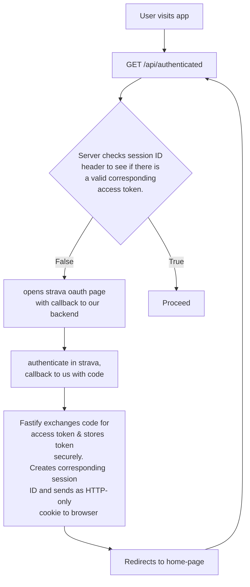
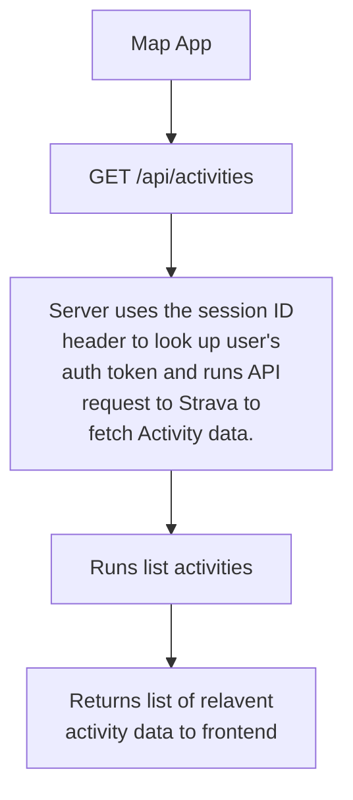

# my-heatmap

A map-centric view for your activity data.

## Developer Instructions

- Run `npm i` in both the client and server directories
- Create a `.env` file in the `server/` directory and add the following keys with values:

```
SESSION_SECRET=<generated with: node -e "console.log(require('crypto').randomBytes(32).toString('hex'))">
STRAVA_CLIENT_ID=<Obtained from Strava here: https://www.strava.com/settings/api>
STRAVA_CLIENT_SECRET=<Obtained from Strava here: https://www.strava.com/settings/api>
FRONTEND_URL=http://localhost:5173
```

- Run `npm run dev` from project root to run vite server and backend server

## Architecture

### Authentication

Backend stores application-level secret key for Strava, and holds client secret keys.



### Fetching Strava Activities

The app interfaces with the Strava API to fetch activity data, especially Polyline map data. This is all included in the `GET /athlete/activities` endpoint.

Requests are handled on the backend to keep the user's Strava access token a secret. This also allows us to use the [Strava-v3](https://www.npmjs.com/package/strava-v3) node npm library to abstract away HTTP requests.

Activity data is not stored on our backend because of costs associated with storing large volumes of data. Instead, the activity data is passed to the user and stored in local browser storage. This also enhances privacy as no pesonal data is stored on our server.



^ Be careful about sending all activities in one response as we may hit memory limit.
Use pagination.
